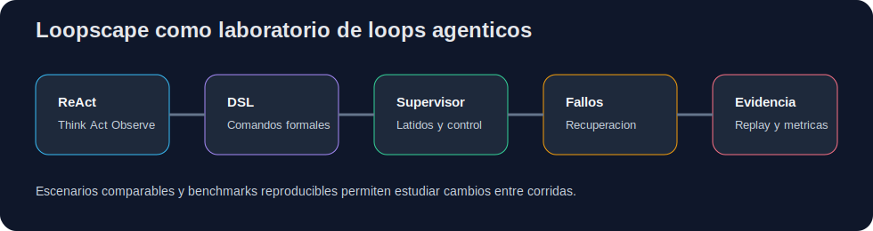
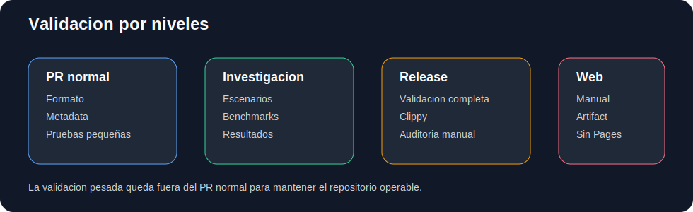
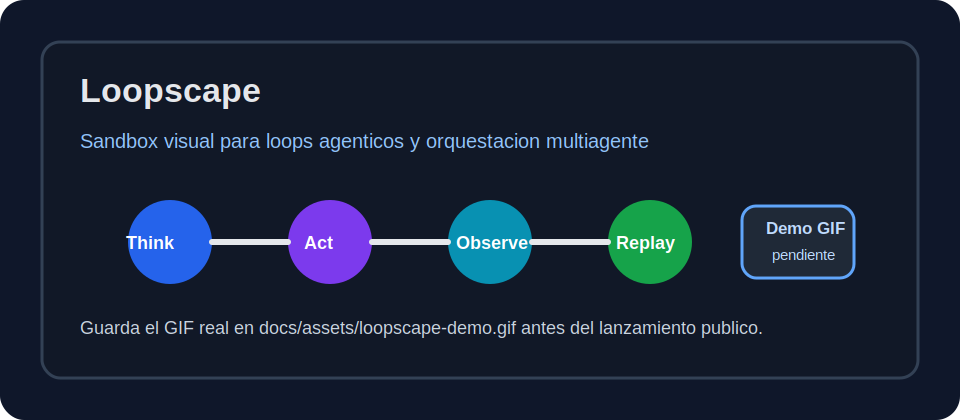

### Loopscape

[](https://github.com/kapumota/loopscape/actions/workflows/ci.yml)


#### Resumen

Loopscape es un sandbox visual de automatizacion y computo cognitivo construido con Rust, Bevy y WebAssembly. El proyecto modela la evolucion de loops agenticos desde un ciclo ReAct secuencial hasta una red de orquestacion multiagente con supervisores, trabajadores, latidos, replay, metricas y fallos simulados.

La version actual corresponde a `0.9.0-rc1`. Es un release candidate experimental preparado para investigacion, docencia avanzada y evaluacion reproducible.

#### Vista rapida





#### Demo visual



El GIF real de la interfaz debe agregarse solo cuando exista el archivo:

```text
docs/assets/loopscape-demo.gif
```

Cuando la demo este grabada, reemplaza la imagen de vista previa por:

```md

```

#### Demo web en Hugging Face Spaces

La demo web de Loopscape esta publicada y probada en Hugging Face Spaces:

[Abrir demo web de Loopscape](https://huggingface.co/spaces/kapumota/loopscape)

La publicacion usa el artefacto web generado por Trunk desde `dist/`. El archivo WebAssembly del Space se almacena con Git LFS porque supera el limite de archivo ordinario.

#### Objetivo del proyecto

El objetivo no es solo mostrar agentes en pantalla. Loopscape busca convertirse en un laboratorio interactivo para estudiar:

- ciclos Think, Act y Observe;
- descomposicion automatica de tareas;
- prompts compartidos como ADN de comportamiento;
- comandos formales de orquestacion;
- supervision multiagente, consenso, fallos y recuperacion;
- replay determinista, metricas comparables y benchmarks reproducibles.

#### Estado actual

Loopscape ya cuenta con una base visual y experimental organizada en cinco eras:

- Era 1: ReAct;
- Era 2: Autoprompting;
- Era 3: Ralph Loop;
- Era 4: Ralph formalizado;
- Era 5: Orquestacion multiagente.

Tambien incluye una linea experimental avanzada:

- nucleo determinista separado de Bevy;
- DSL con lexer, parser, validador e interprete;
- visor DSL;
- exportacion e importacion de grafo JSON;
- eventos JSONL y replay determinista;
- metricas CSV y comparacion de corridas;
- proveedor LLM mock y proxy opcional con limites;
- supervisor real con fallos recuperables y fallo bizantino simplificado;
- auditoria manual de workflows, Rust, secretos y validacion profunda;
- reportes de evidencia;
- escenarios comparables y benchmarks reproducibles;
- informe tecnico interno y resultados preliminares.

#### Requisitos

- Rust estable;
- target `wasm32-unknown-unknown` para compilacion web;
- Trunk para ejecutar o compilar la version WebAssembly;
- Node.js solo si se usa el proxy local de LLM;
- Git para trabajar por ramas y generar patches.

#### Instalacion rapida

```bash
rustup target add wasm32-unknown-unknown
cargo install trunk --locked
```

#### Uso nativo

```bash
cargo run
```

#### Smoke nativo

Para verificar que el binario arranca y que el nucleo determinista ejecuta un numero pequeño de ticks:

```bash
cargo run -- --smoke --seed 123 --ticks 10
```

Tambien se puede usar:

```bash
make smoke-native
```

#### Uso web local

```bash
trunk serve
```

Luego abre:

```text
http://localhost:8080
```

#### Validacion recomendada

```bash
make setup
make validate
make smoke-native
make clean
```

Para validar el artefacto web de forma explicita:

```bash
make setup-web
make validate-web
```

Para una revision de release candidate:

```bash
make validate-full
make validate-web
cargo clippy --all-targets -- -D warnings
```

#### Escenarios comparables

Los escenarios comparables viven en `scenarios/`:

```text
scenarios/react_basic.loop
scenarios/dsl_delegation.loop
scenarios/multiagent_failure.loop
```

Estos archivos sirven como entradas estables para pruebas, benchmarks e informe tecnico.

#### Benchmarks reproducibles

La configuracion de benchmarks vive en `benchmarks/` y el script principal es:

```bash
bash scripts/run_benchmarks.sh
```

El script genera resultados locales en:

```text
artifacts/benchmarks/
```

Los resultados generados no se versionan. Solo se conserva `artifacts/benchmarks/.gitkeep`.

#### Controles

| Tecla | Accion |
|---|---|
| `1` a `5` | Cambiar entre eras |
| `WASD` o flechas | Mover camara |
| `M` | Mutar ADN en Era 3 |
| `B` | Inyectar fallo bizantino en Era 5 |
| `L` | Alternar panel LLM |
| `X` | Alternar modo Rayos X |

#### Estructura principal

```text
src/
  main.rs
  core/
  dsl/
  eras/
  systems/
scenarios/
benchmarks/
scripts/
docs/
artifacts/
```

#### Documentacion principal

- `docs/ARQUITECTURA.md`: arquitectura base del proyecto.
- `docs/PLAN_FASES_AVANZADO.md`: plan de fases del proyecto.
- `docs/VALIDACION_POR_NIVELES.md`: matriz de validacion progresiva.
- `docs/ESCENARIOS_COMPARABLES.md`: descripcion de escenarios comparables.
- `docs/BENCHMARKS.md`: ejecucion y lectura de benchmarks.
- `docs/INFORME_TECNICO.md`: informe tecnico interno.
- `docs/RESULTADOS.md`: resultados preliminares.
- `docs/RELEASE.md`: proceso de release.
- `docs/RELEASE_CANDIDATE.md`: alcance de `v0.9.0-rc1`.
- `docs/REVISION_RELEASE_CANDIDATE.md`: revision posterior al release candidate.
- `docs/INDICE_FINAL.md`: indice final del repositorio.
- `docs/HF_SPACES_DEMO.md`: preparacion de demo web para Hugging Face Spaces.

#### Flujo por rama

```bash
git checkout main
git pull --ff-only origin main
git checkout -b fase-nombre

make validate

git add .
git commit -m "fase n: descripcion del cambio"
git push -u origin fase-nombre
```

Despues se abre un Pull Request hacia `main` y se revisa el resultado de CI antes de fusionar.

#### Flujo con patches

Para generar un patch desde la rama de trabajo:

```bash
git diff main...HEAD > patches/fase-nombre.patch
```

Para aplicar un patch en otra copia del repositorio:

```bash
git checkout -b fase-nombre
git apply patches/fase-nombre.patch
make validate
```

#### Politica de CI

El flujo principal de GitHub Actions debe mantenerse liviano. Los PR normales deben validar formato, metadata, pruebas pequeñas y documentacion. Los workflows pesados quedan como ejecuciones manuales.

El workflow web debe mantenerse manual:

```text
workflow_dispatch
sin push automatico
sin GitHub Pages automatico
sube dist como artifact
```

#### Release candidate

El release candidate actual es `0.9.0-rc1`. El tag debe crearse solo desde `main` actualizado despues de fusionar el PR correspondiente.

```bash
git checkout main
git pull --ff-only origin main
git tag -a v0.9.0-rc1 -m "release candidate v0.9.0-rc1"
git push origin v0.9.0-rc1
```

#### Licencia

MIT. El proyecto esta orientado a educacion, investigacion aplicada y prototipado de sistemas interactivos.
